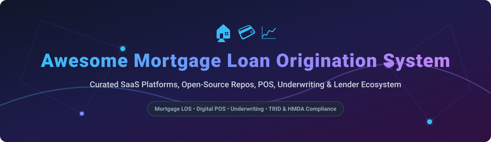

# 🏠 Awesome Mortgage Loan Origination System (LOS) 🚀

   

## 📌 Top Mortgage Loan Origination System (LOS) & Lending Ecosystem

> **Curated List of SaaS Products, Enterprise Platforms & Open-Source GitHub Projects**  
> *Focused on Mortgage Loan Origination, Digital Point-of-Sale (POS), Automated Underwriting Workflows, TRID/HMDA Regulatory Compliance, Closing & Lender Technology Stacks.*  
> **Last updated: September 2026** 📅

---

### 🔍 Overview & Industry Insights
This repository tracks notable **SaaS platforms** and **open-source projects** for **Mortgage Loan Origination Systems (LOS)**. These systems manage the end-to-end process of originating residential mortgage loans—from borrower application intake and point-of-sale (POS) through processing, underwriting, closing, and secondary-market delivery—while enforcing regulatory compliance and document management.

#### 📊 Market Size & Industry Structure
- **Estimated Market Size**: The Global Mortgage Loan Origination System (LOS) software market is estimated at **$5.8 Billion in 2026** and projected to reach over **$10.2 Billion by 2032** growing at a CAGR of ~9.8%.
- **Market Concentration**: The mortgage LOS sector is **highly concentrated** (winner-take-most dynamics), dominated by core enterprise platforms (such as ICE Encompass handling over 40-50% of US residential mortgage volumes) alongside key commercial POS and specialty workflow suites.

---

## 📑 Table of Contents
- [🏢 SaaS & Commercial Platforms](#-saas--commercial-platforms)
- [🔓 Open-Source GitHub Projects](#-open-source-github-projects)
- [🤝 How to Contribute](#-how-to-contribute)
- [⚠️ Disclaimer](#%EF%B8%8F-disclaimer)
- [💖 Support & Sponsorship](#-support--sponsorship)
- [📈 Star History](#-star-history)

---

## 🏢 SaaS & Commercial Platforms

| Platform | Key Focus & Description | Estimated Revenue / Valuation | Starting Pricing Tier | Free Tier / Free Trial Limit |
| :--- | :--- | :--- | :--- | :--- |
| **[ICE Encompass](https://www.icemortgagetechnology.com/)** | Dominant enterprise mortgage LOS used by top lenders for end-to-end origination, compliance, underwriting, closing, and investor delivery. | **~$2.1B+ Annual Revenue** (ICE Mortgage Tech Division) | $1,500 / month platform fee + ~$8-$15 per closed loan | No free tier; 30-day enterprise sandbox demo available upon sales inquiry |
| **[Blend](https://blend.com/)** | Leading digital lending & POS platform delivering modern borrower application intake, automated asset verifications, and LOS sync. | **~$150M Annual Revenue** (~$600M Market Cap) | $500 / month base fee + ~$10 per application | No free tier; 14-day interactive demo environment for prospective lenders |
| **[MeridianLink Mortgage](https://www.meridianlink.com/)** | Comprehensive loan origination & credit decisioning platform tailored for credit unions, regional banks, and mortgage lenders. | **~$310M Annual Revenue** (~$1.4B Market Cap) | $800 / month base fee + tiered loan volume pricing | No free tier; personalized sales demo provided on request |
| **[SimpleNexus](https://simplenexus.com/)** | Mobile-first digital mortgage POS platform connecting loan officers, borrowers, realtors, and settlement agents. | **~$80M Annual Revenue** (Acquired by nCino for ~$1.2B) | $450 / month base fee + $25 per active loan officer/month | No free tier; 14-day guided sandbox demo available for mortgage brokers |
| **[Calyx Point](https://www.calyxsoftware.com/)** | Desktop and cloud-based LOS popular among mortgage brokers, credit unions, and independent mortgage bankers. | **~$45M Annual Revenue** (Private) | $120 / seat / month (Point Central edition) | No free tier; 30-day full-feature trial version available |
| **[LendingPad](https://www.lendingpad.com/)** | Modern cloud-native LOS featuring real-time collaborative editing for brokers, bankers, and wholesale lenders. | **~$25M Annual Revenue** (Private) | $40 / user / month (Broker Edition, billed annually) | No free tier; 14-day free trial available (up to 5 test loan files) |
| **[Byte Software](https://www.bytesoftware.com/)** | Highly configurable LOS offering deep compliance checks, custom document generation, and workflow automation. | **~$18M Annual Revenue** (Private) | $95 / user / month base subscription | No free tier; 15-day trial account available on request |

---

## 🔓 Open-Source GitHub Projects

> **Open-Source Status Note**: Production-ready, fully compliant mortgage LOS platforms are almost non-existent in open source due to strict U.S. residential lending regulations (TRID, HMDA, RESPA). However, the repositories below serve as valuable building blocks, core engines, decisioning systems, and reference architectures.

The repositories below are sorted by GitHub_Stars_Count (Descending) ⭐:

| Project | Description | Github_Stars |
| :--- | :--- | :--- |
| **[Flowable Engine](https://github.com/flowable/flowable-engine)** | Light-weight business process (BPMN) & workflow engine widely used as the core state-machine for custom loan origination pipelines. |  |
| **[Camunda Platform](https://github.com/camunda/camunda)** | Enterprise process orchestration engine designed to automate complex, multi-step financial approval and loan origination workflows. |  |
| **[Apache Fineract](https://github.com/apache/fineract)** | Open-source core banking platform and financial services engine providing APIs for account management and loan portfolios. |  |
| **[Form.io Engine](https://github.com/formio/formio)** | Combined form builder and API engine used for constructing dynamic loan application forms and borrower data collection. |  |
| **[Mifos Web App](https://github.com/openMF/web-app)** | Community web application front-end built for Apache Fineract, handling loan applications and customer management. |  |
| **[Mifos X Community App](https://github.com/openMF/community-app)** | Standard UI client for the Mifos / Fineract platform for managing loan origination, client intake, and repayments. |  |
| **[DigiFi LOS (Community Lineage)](https://github.com/getsan4u/loan-origination-system)** | Modular open loan origination system architecture covering application intake, decisioning rules, and underwriting CRM. |  |
| **[OpenCBS Loan Origination](https://github.com/OpenCBS/Loan-Origination-Solution)** | Loan origination workflow management system supporting multi-role approval chains and credit scoring integrations. |  |
| **[Agentic AI Loan Origination](https://github.com/rh-ai-quickstart/multi-agent-loan-origination)** | Multi-agent AI orchestration demo for mortgage lending lifecycles, covering borrower inquiries through underwriting. |  |
| **[Apache Fineract Loan Origination PoC](https://github.com/apache/fineract-loan-origination)** | Proof-of-concept loan origination service managing pre-disbursement workflows before pushing loans into Fineract core. |  |

---

## 🤝 How to Contribute

Contributions are highly welcome! To contribute to this curated list:
1. 🍴 Fork this repository.
2. 📝 Add or edit entries in `README.md` following the exact table structure.
3. 🔍 Ensure descriptions remain objective and pricing/star information is accurate.
4. 🚀 Submit a Pull Request with a short summary of your addition.

---

## ⚠️ Disclaimer

- This list is **community-curated** for research, educational, and software evaluation purposes.
- Residential mortgage lending is subject to strict federal and regional regulations (TRID disclosures, HMDA reporting, ECOA fair lending, RESPA).
- Open-source tools listed here are building blocks or prototypes. Do **not** deploy open-source components into live mortgage production environments without thorough legal, compliance, and security audits.

---

## 💖 Support & Sponsorship

If you find this repository valuable for your fintech research or mortgage software engineering project, please consider supporting the project:

- ⭐ **Star** this repository on GitHub.
- 📢 **Share** it with fellow developers and mortgage tech professionals.
- ☕ **Buy me a coffee** / sponsor on GitHub: [Sponsor Dashboard](https://github.com/sponsors/ishandutta2007)

Thank you for supporting open-source fintech resources! 🙏

---

## 📈 Star History

